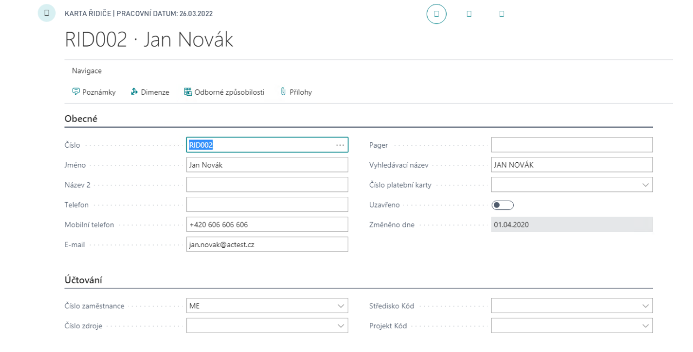
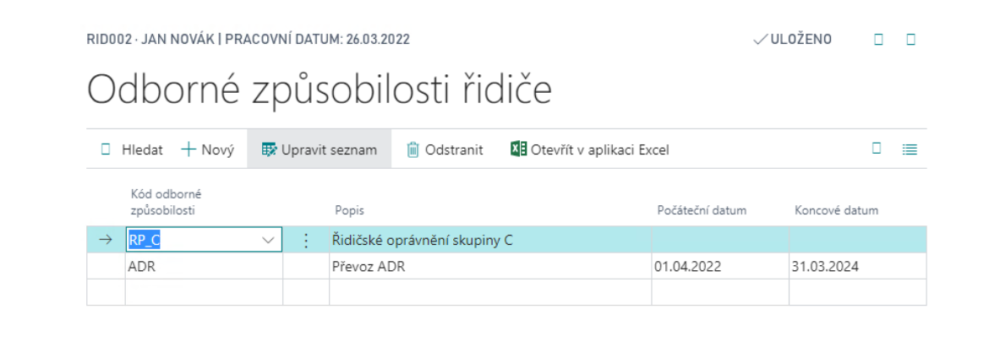
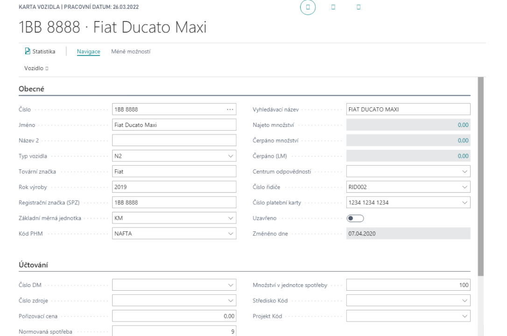
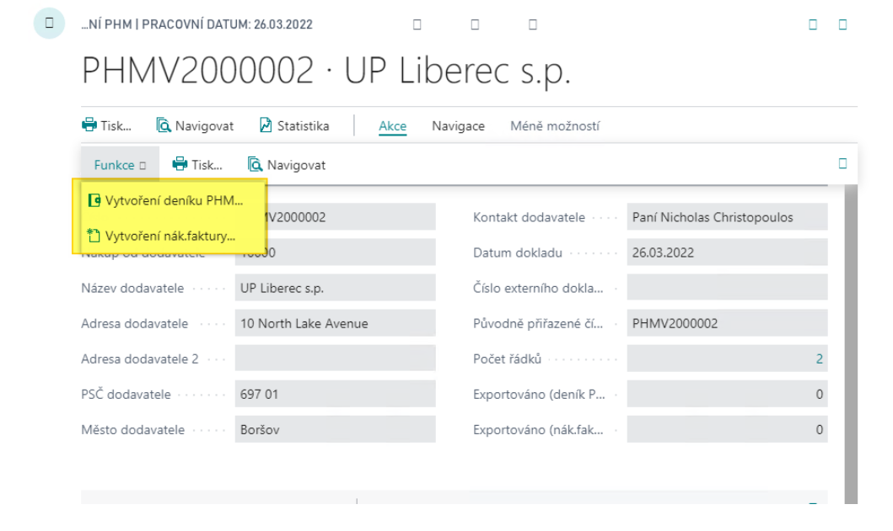
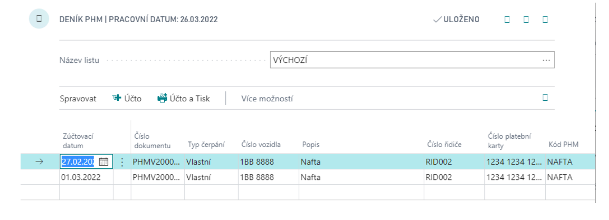
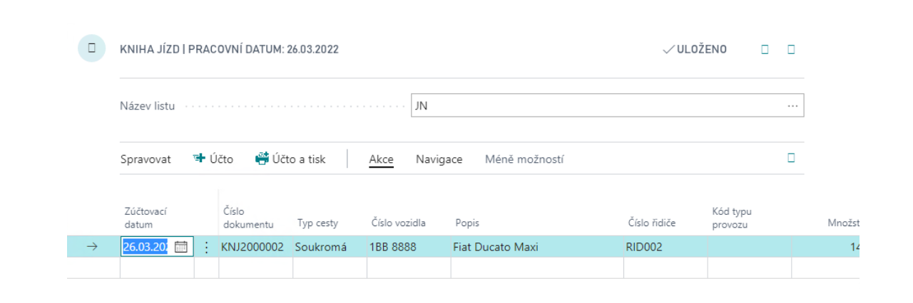
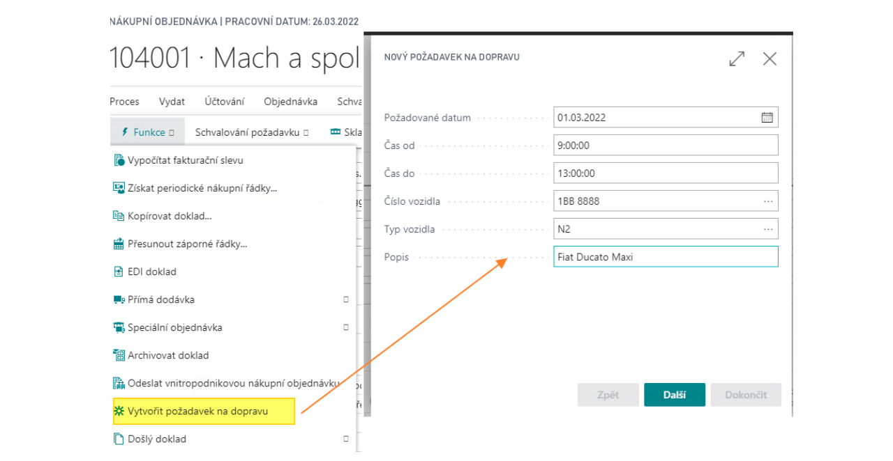
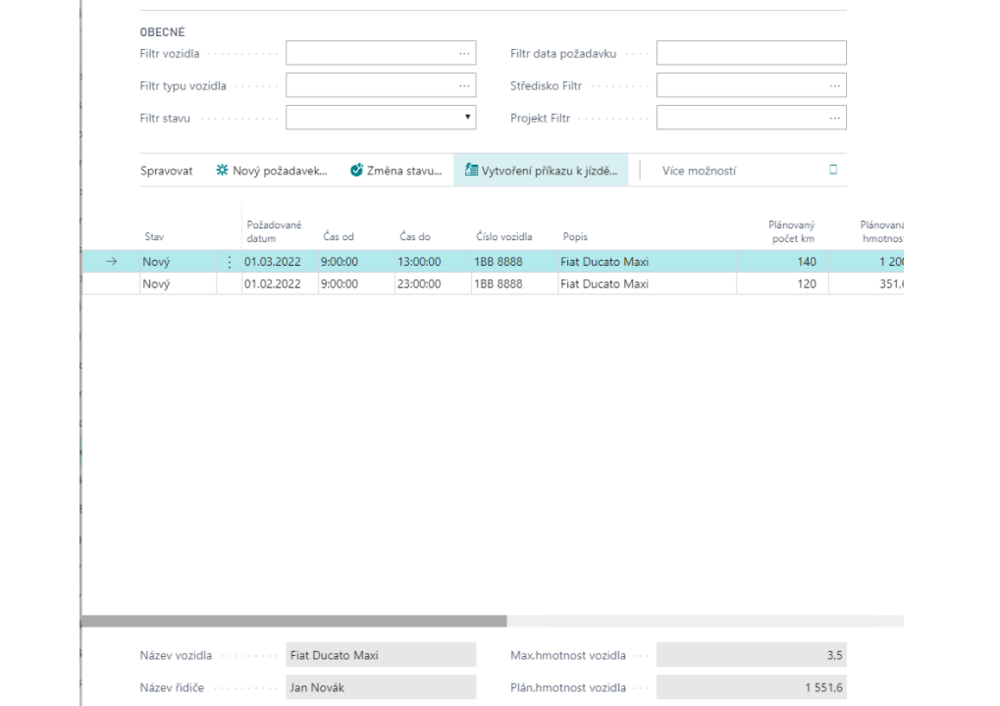

# Transport - Basic

The Transport add-on solves the issue of vehicle registration, vehicle maintenance planning, driver records, logbook records and fuel consumption records (including the possibility of importing purchase files on fuel cards, e.g. CCS).

## Definition of drivers
The driver card defines the monitored person and the information linked to it.

To create a new driver, follow these steps:
1. Choose the , icon, enter **Driver List** and then choose the related link.
2. In the overview, select **New**.
3. Na kartě řidiče vyplňte potřebné informace.

It is possible to store "**Competencies**" to the driver - i.e. things related to the person as a driver - driving licences, special licences and at the same time to set the validity of these competencies. You can find the Professional Qualifications in the navigation section of the driver card page.

## Definition of vehicles
Vehicles are defined for consumption monitoring and maintenance needs. It is possible to record information about the vehicle as its own, as well as a link to the assigned payment card (for the purpose of importing the drawdown), the assigned (default driver) and links to other records (Property, source....)

To create a vehicle card, follow these steps:
1. Choose the , icon, enter **Vehicle List** and then choose the related link.
2. In the overview, select **New**.
3. Na kartě vozidla vyplňte potřebné informace.

Additional data can be defined for the vehicle:
- **Equipment** – the equipment with which an individual vehicle is equipped.
- **Units of measure** – used with this vehicle.
- **Cost** – standard costs/prices for each type of operation.
- **Consumption** – standard vehicle consumption for individual types of operation.
- **Maintenance records** – monitoring of vehicle maintenance incl. dates of next maintenance.

## Refuelling Statement
The "Refuelling Statement" is used to enter the fuel consumption for vehicles. These drawdowns are ready for import from the vendor file, alternatively they can be entered manually.

To create a Refuelling Statement, follow these steps:
1. Choose the , icon, enter **Refuelling Statement** and then choose the related link.
2. In the overview, select **New**.
3. Fill in the necessary information on the card.
4. Fill in the individual lines and issue the document.

Refuelling Statement List

5. The next step in processing the statement is its "Issue". The following functions can be used on the Issued Refuelling Statement:
   
   - Create Fuel Journal – to record pumping items to the vehicle
   - Create Purchase Invoice – to create a purchase invoice based on a drawdow

6. The last step is to post the Fuel Journal:
   

## Drive Journal
It is used to record the operation of the vehicle, it is entered via the Drive Journal

To fill in the Drive Journal, follow these steps:
1. Choose the , icon, enter **Drive Journal** and then choose the related link.
2. Fill in the lines as needed.
   - Drive Type, Vehicle No., Description, Driver No., Opeation Type Code and more.
3. Post the journal.

If the extended traffic planning functionality is used, the function for pre-generation of the Drive Journal based on the issued driving commands can be used.

## Transport planning

This section is part of the extended version of  **Transportation – Planning**.

As part of the planning, the so-called **Transport request**, which is a record of the anticipated transport, these requests can be created from **Sales order**, **Purchase order**, **Transfer order** using the **Create shipping request** function.

To create a request from a purchase order, follow these steps:
1. Choose the , icon, enter **Purchase Order** and then choose the related link.
2. Open an existing order or create a new one.
3. Use the **Create Transport Request**feature to create a shipping request.
4. Complete the Shipping Request Wizard.

This function is a wizard where it pre-fills the maximum amount of data from the input document. The prerequisite is that these requests are made by ordinary users processing documents.

The next phase is the actual "**Transport Planning**" using the "Transport Dispatcher Board" page - where the responsible employee can see the individual requests and can process them - plan data, assign vehicles/drivers, combine according to available capacities, etc.

Demand states are addressed in the planning process:
- New – only created
- Scheduled – A driving command is created
- Closed – Transport completed

**See also**

[Transport - Basic - Setup](ac-transport-basic-setup.md)  
[Productivity Pack](ac-productivity-pack.md)
