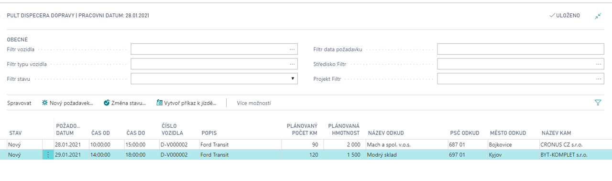

# Doprava - Plánování

Modul Doprava – plánování rozšiřuje základní modul dopravy zejména o řízení a plánování jízd pomocí příkazů k jízdě a pomocí pultu dispečera dopravy.
Centrem plánování dopravy je formulář Pult dispečera dopravy, který zobrazuje požadavky na dopravu nové, zaplánované i uzavřené. V řádcích jsou jednotlivé požadavky, v hlavičce pak filtry na filtrování řádků přes vozidlo, typ vozidla, stav požadavku, datum požadavku a přes globální dimenze.

**See also**

[Doprava - plánování - nastavení](ac-transport-planning-setup.md)  
[Productivity Pack](ac-productivity-pack.md)
