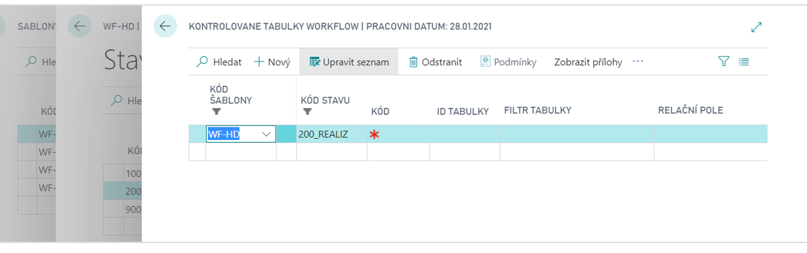

# WorkFlow - kontrolované tabulky

Add-on modul Workflow – kontrolované tabulky rozšiřuje funkčnost add-on modulu Workflow o možnost kontroly záznamů nebo polí v tabulkách svázaných s tabulkou, která je řízena workflow.
Stav workflow je pak povoleno změnit pouze pokud všechny kontroly v rámci kontrolovaných tabulek vyhovují. Practical uses may include the following:

- Pokud je použito workflow na dokladu s hlavičkou a řádky, například na Prodejní objednávce, lze kontrolovat, zda k hlavičce existují nějaké řádky, nebo řádky nějakého typu nebo obsahu. For example, that the order contains at least one line with the item, or that it has a price or location or global dimension filled in on all lines.
- Lze kontrolovat, zda zdrojový záznam k nějakému poli v tabulce s použitým workflow obsahuje v dalších polích potřebná data – např. je-li na hlavičce dokladu vyplněno pole Kód prodejce, pak zkontroluje zda-li má tento prodejce vyplněn email.

**See also**

[WorkFlow - kontrolované tabulky - nastavení](ac-workflow-linker-tables-setup.md)  
[Productivity Pack](ac-productivity-pack.md)

