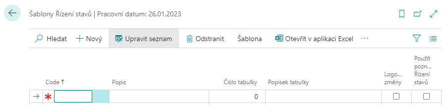
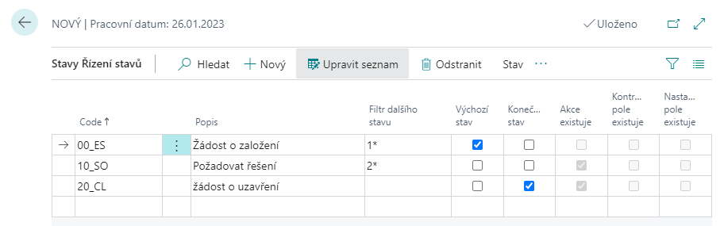
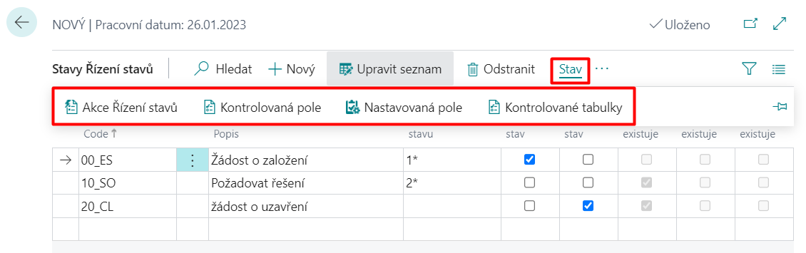

# WorkFlow - State Management - Setup

## Set up a state management template

1. Choose the , icon, enter **Status Management Templates** and then choose the related link.
2. On the **Status Management Templates** page choose **New** action.
3. Fill in the **Code**, **Description**, and **Table No.** fields (for which the template will be set).
4. If you want changes to be automatically logged, select the **Log changes** check box.

5. To specify individual states for the newly created State Management, click the **Template** action, and then click **Status Mgt. States**.

For each Status management state, you must define a **Code**, **Description**, and **Next status filter** that determines what other states can be accessed from that state. Just one of the states must be marked as **Default Status** (by checking the Default Status button). This state is then automatically filled in when a new row is created in the table with which the state control works (document, request, etc.).

Some states may be labeled as **Final Status**, from which no further state is continued.

An example of state settings for State Control is shown in the figure below.

For the active row on the **Status Management States page**, you can use the **Status** function to specify:
- **Status management Actions**
- **Checked fields**
- **Set Fields**
- **Checked Tables**

### Checked fields
For each state (the row on the Status Management Statuses page), you can define fields to check when you enter that state.

For the fields to be checked, it is necessary to fill in at least **Code**, **Fields No.** (where the field that should be checked is recorded) and the **Value Checking** field (indicates what type of check will be performed when the state is set):
- **Code Mandatory** – If you enter this option in the Check value field, the system will check if any value is entered in the field (which you entered in the field Field No.). If the field is filled in arbitrarily, it will be possible to switch the state to the given state.
- **Same Code** – This option indicates that the field (which is populated in the Field ID field) must be filled with the same value as the **Value** field on the Controlled Fields page. In this case, you can't fill in the Compare Condition field.
- **No Code** – The field (which is filled in the field Field No.) must not be filled in when entering the given state.
- **Compare Value** - When you select this option, the system compares the value in the field with the value filled in the **Value** field on the Status Management Checked Fields page. Therefore, the Value field must be filled in when you select this option. The difference to the Same Code option is that in the **Condition** field of the comparison you can select the comparison method (Equal, Not Equal, Less than, Less than or Equal, Greater than, Greater than or Equal).
- **Compare Fields** - When selecting this option, it is important to fill in the **Comparison Field No.** field. This field determines which field we will compare the field to. It is also important to fill in the **Compare Condition**field, where we can also specify comparison methods as in the previous option.

### Set Fields
It is possible to define fields for each status, which will be set when entering this status.

For the field you are setting, you must fill in **Field No.** and **Value** fields. The Value field specifies what value the field is set to when it goes to the Status Management status.

### Status Management Actions
The Actions define Codeunits, Reports and XMLPorts that can be run when entering a given status. Codeunits for events can be created by the partner himself according to his own needs in the object numbers allowed by his license.

For each status, you can define the actions that will be performed when you transition to that state. For Action, you must define the **Action Code**, **Field No. (Value),** and **Value** fields.

In the **Field No. (Value)** field, it is defined from which field the content is taken and passed as a parameter to the action (e.g. when the status on the customer card changes, it is possible to fill in the field number 102 and the contents of the E-mail field are passed to the action as a parameter). In the Value field, a value is entered directly, which is passed to the action as a parameter (for example, a specific email).
Using the Mail Texts function, you can define the content of the mail (subject and custom text). It is possible to insert codes into the text, which are replaced by the contents of the fields when you send the mail. Codes are defined using the Mail Fields function

### Checked Tables
This feature helps you check the field you set on another page (in a different table, such as the table you're currently working in). It is a similar feature to the Status Management Actions. With this function, you can verify or a field on another page is set as needed when you transition to the state where you are using this feature.

If you click the Checked Tables feature, the Status management Checked Tables page opens, where the **Template Code** and **Status Code** fields are automatically populated. On this page, you need to fill in the **Code** field, **Table ID** in which you want to check a field, the **Table Checking Condition**, and possibly the **Value** field.

## See also

[WorkFlow - Status management](ac-workflow-status-management.md)  
[Productivity Pack](ac-productivity-pack.md)
