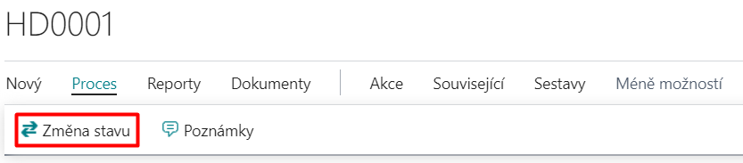

# Řízení stavů

Add-on modul **Řízení stavů** přidává do systému Microsoft Dynamics 365 Business Central nástroje pro řízení stavů při postupném zpracování úloh jedním či více uživateli. Umožňuje konfigurovat stavy zpracování, ve kterých se může úloha (doklad, záznam) nacházet. Umožňuje také sledovat aktuální stav a průběh zpracování a následně automatizovaně vyplňovat formuláře a záznamy definovanými hodnotami či spouštět libovolné programové akce při změně stavu úlohy (dokladu, záznamu). Uplatňuje se zejména pro řízené schvalování a oběh dokladů.

Add-on Řízení stavů je především o správném nastavení. Pokud chcete tenhle add-on používat, tak hlavnou z funkčností je změna stavu.

## Změna stavu
Pro přechod do další fáze řešení úlohy (dokladu, záznamu) je třeba kliknout na funkci **Proces** a pak na možnost **Změna stavu** (tuto funkci můžete najít také v informačním panelu pro danou úlohu, doklad nebo záznam, pro který je řízení stavů nastaven).

Po kliknutí na tuto funkci se nabídnou další stavy řízení stavů, které podle definice filtru dalšího stavu připadají v úvahu.

Po dokončení operace je aktualizován **Kód stavu Řízení stavů** na kartě úlohy, dokladu nebo záznamu.

## Kontrolované tabulky

Funkce kontrolované tabulky rozšiřuje funkčnost add-onu Řízení stavů o možnost kontroly záznamů nebo polí v tabulkách svázaných s tabulkou, která je řízena Řízením stavů.

Stav Řízení stavů je pak povoleno změnit pouze pokud všechny kontroly v rámci kontrolovaných tabulek vyhovují. Praktické použití může být například toto:

- Pokud je použito Řízení stavů na dokladu s hlavičkou a s řádky, například na Prodejní objednávce, lze kontrolovat, zda k hlavičce existují nějaké řádky, nebo řádky nějakého typu nebo obsahu. Např. že objednávka obsahuje alespoň jeden řádek se zbožím, nebo že má na všech řádcích vyplněnu cenu nebo lokaci nebo glob. dimenzi, apod.
- Lze kontrolovat, zda zdrojový záznam k nějakému poli v tabulce s použitým Řízením stavů obsahuje v dalších polích potřebná data – např. je-li na hlavičce dokladu vyplněno pole Kód prodejce, pak zkontroluje zda-li má tento prodejce vyplněn email.

## See also

[WorkFlow - řízení stavů - nastavení](ac-workflow-status-management-setup.md)  
[Productivity Pack](ac-productivity-pack.md)
