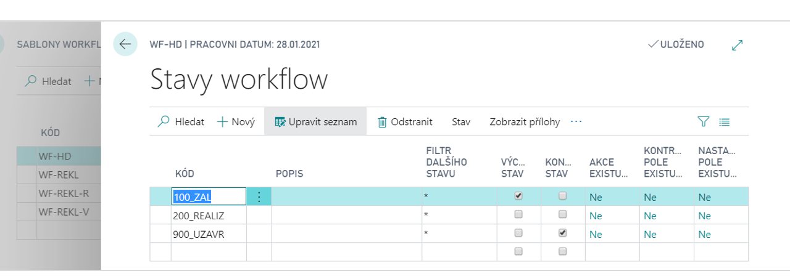

# WorkFlow - State Management

Add-on modul Workflow – řízení stavů přidává do systému Dynamics 365 Business Central nástroje pro řízení stavů při postupném zpracování úloh jedním či více uživateli. Umožňuje konfigurovat stavy zpracování, ve kterých se může úloha (doklad, záznam) nacházet, sledovat aktuální stav a průběh zpracování a následně automatizovaně vyplňovat formuláře a záznamy definovanými hodnotami či spouštět libovolné programové akce při změně stavu úlohy. Uplatňuje se zejména pro řízené schvalování a oběh dokladů.

**See also**

[WorkFlow - řízení stavů - nastavení](ac-workflow-status-management-setup.md)  
[Productivity Pack](ac-productivity-pack.md)
