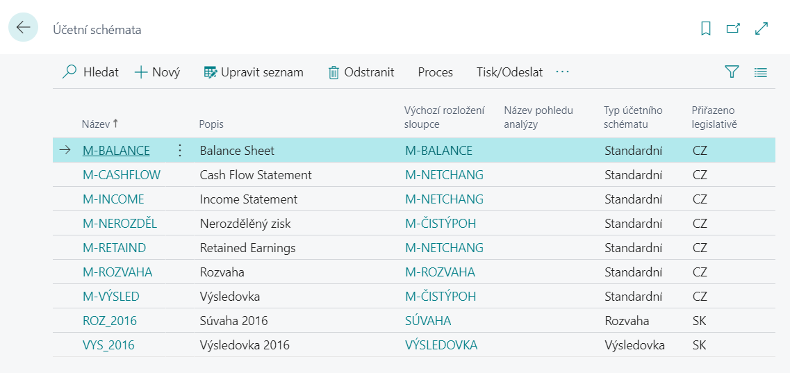
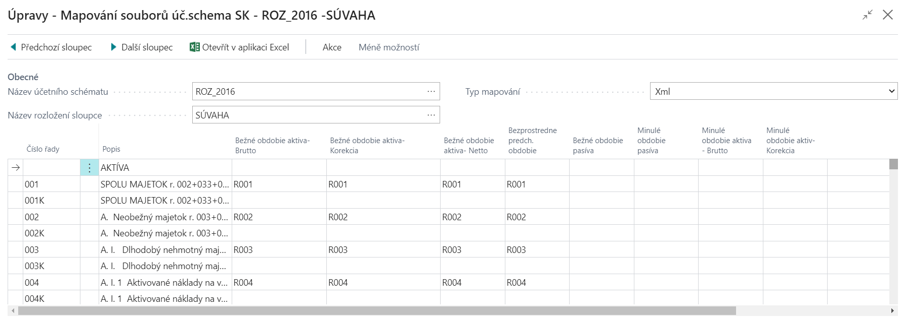

# Export of financial statements - SK - Setup

To define the statutory statements of Slovak legislation (Balance Sheet and Profit and Loss Statement), the D365 BC system uses the standard functionality of accounting schemes supplemented by adjustments that allow the import of financial statements to the portal of the Financial Administration of the Slovak Republic through a .xml file.

To ensure the export of financial statements, it is necessary to set several areas listed below.

## Differentiation of schemes for the selected country

The **Assing Legislation** field in the list of accounting schemes is used to differentiation between Czech and Slovak statutory statements.

1. Choose the , icon, enter **Account Schedule** and then choose the related link.
2. In the **Assing Legislation**column, select **SK** for Slovak statutory statements.

You can see an example in the picture below:

## Accounting Schema File Mapping

For individual cells of the account schema, it is necessary to set the appropriate values of the xml file elements according to the instructions of the technical documentation. For each row of the report it is necessary to set the mapping of the current and previous period.

1. Choose the , icon, enter **Account Schedule** and then choose the related link.
2. On the **Account Schedules**page, choose the **Process** action, and then choose **Edit Account Schedule**.
3. On the tab of the selected **Account Schedule** choose the **Actions** button, and select **File Mapping SK** feature.
4. On the **Edit - Acc. Schedule File Mapping SK** page, select Xml in the **Mapping Type** field. In the account schedule fields, enter the appropriate element values according to the technical requirements of the xml template.
5. Close the page after editing.

You can see an example in the picture below:

## See also

[AUTOCONT Solutions](../index.md)  
[SK Legislative pack](ac-sk-legislative-pack.md)  
[Export of financial statements - SK](ac-sk-balance-sheet-income-statement.md)
