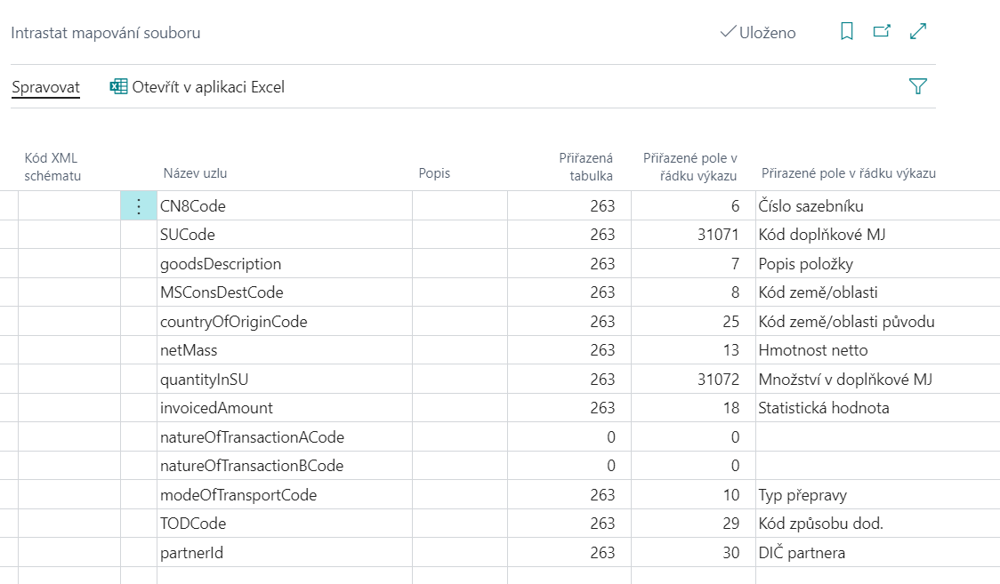

# Výkaz Intrastat

Pro účely generování výkazu Intrastat se používá standartní funkcionalita.

Rozdíl oproti standardní funkčnosti je v struktuře souboru s příponou .xml generovaném pro účely slovenského vykazování.

Pro aktivování slovenských funkčností jsou potřebná tato nastavení, využijte následující postup:

## Nastavení financí

1. Vyberte ikonu , zadejte **Nastavení financí** a poté vyberte související odkaz.
2. Na kartě **Nastavení financí** je nutné vybrat do pole **Legislativa** hodnotu **SK**.
3. Potvrďte pomocí tlačítka **OK**.

## Intrastat mapování souboru

Nastavení slouží pro mapování polí v aplikaci na uzly .xml. Tato tabulka je součástí dodávaného konfiguračního balíčku.

1. Vyberte ikonu , zadejte **Intrastat mapování souboru** a poté vyberte související odkaz.
2. Na kartě **Intrastat mapování souboru** zkontrolujte, nebo doplňte nastavení.
3. Potvrďte pomocí tlačítka **OK**.

## Export souboru pro Intrastat

1. Vyberte ikonu , zadejte **Deníky Intrastat** a poté vyberte související odkaz.
2. Vložte řádky deníku pomocí funkce **Návrh řádků**.
3. Exportujte pomocí funkce **Exportovat**, je nutné vyplnit *Kontaktní osoba*, *Typ*, *Pořadové číslo výkazu*
4. Potvrďte pomocí tlačítka **OK**.

## See also

[AUTOCONT Řešení](../index.md)  
[SK Legislativní balíček](ac-sk-legislative-pack.md)
