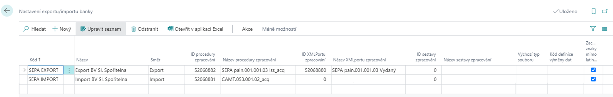

# SEPA Payments

For the processing of a payment order or statement in SEPA format, the standard functionality of the system is used.

## SEPA payment settings:

1. Choose the , icon, enter **Bank Export/Import Setup** and then choose the related link.
2. A page will appear, which may contain a list of already set imports and exports.
3. If you want to properly set up import and export in SEPA format, this page must contain the lines shown in the image below.

4. If you want to set the export format on a specific bank account, go to the bank account card and set the required values ​​in the fields **Foreign Payment Export Format** and **Payment Export Format** on the **Transfer** tab.

## See also

[AUTOCONT Solution](../index.md)  
[SK Legislative Pack](ac-sk-legislative-pack.md)
