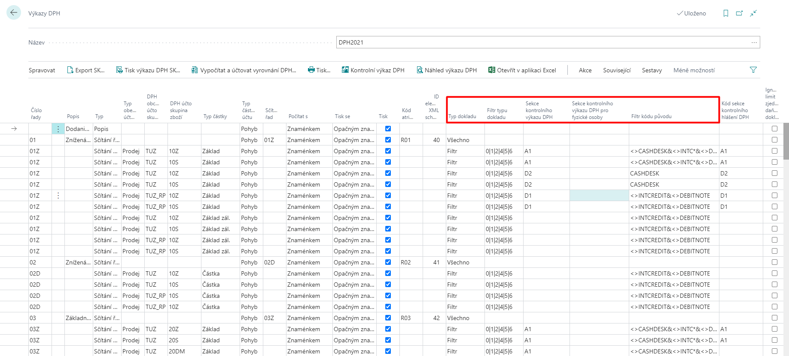
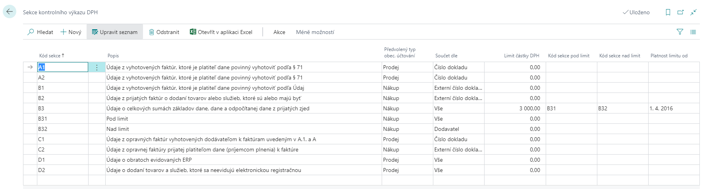

# Kontrolní výkaz DPH - nastavení

Pro zajištění správné funkčnosti je potřeba nastavit několik níže uvedených oblastí.

## General Ledger Setup

To activate Slovak functionality, follow these steps:

1. Choose the , icon, enter **General Ledger Setup** and then choose the related link.
2. On the **General Ledger Setup** page you must select**SK** in **Legislation**field.
3. Confirm with the **OK** button.

## Setting up XML schemas

XML schéma ke Kontrolnímu výkazu DPH je potřebné do aplikace naimportovat do XML schémat.

1. Choose the , icon, enter **XML Schemas** and then choose the related link.
2. Na stránce **XML schémata** vyberte akci **Načíst schéma**.
3. An import window will open where you select the appropriate XML file.
4. Po import se na kartě **XML schémata** objeví nový řádek.
5. Do pole SML portID vyberte hodnotu **52068871** -platná od 1.1.2020.
6. do pole **Přiřazeno legislativě** vyberte hodnotu **SK**.
7. Confirm with the **OK** button.

## Nastavení řádků výkazu DPH - rozšíření

Pro zajištění správného vykazování Kontrolního výkazu DPH je potřeba nastavit pole v řádcích výkazu DPH:

1. Choose the , icon, enter **VAT Statements** and then choose the related link.
2. For each line in the sales tax statement, define the following fields:

- Source Code filter
- Document type
- Document type filter
- Sekce kontrolního výkazu DPH
- Sekce kontrolního výkazu DPH pro fyzické osoby

3. Confirm with the **OK** button.

## Nastavení sekcí kontrolního výkazu DPH

Use the following procedure to set up:

1. Vyberte ikonu , zadejte **Sekce kontrolního výkazu DPH** a poté vyberte související odkaz.
2. Nastavte kódy sekcí dle platných nařízení pro vykazování.
3. Pro vykazování přijatých zjednodušených faktur je potřeba nastavit **Kód sekce pod limit** a **Kód sekce nad limit**. Zároveň se vyplní i pole **Limit částky DPH** a **Platnost limitu od**.

## Nastavení sloupců sekcí kontrolního výkazu DPH

Pro jednotlivé sekce je potřeba nastavit sloupce, které budou exportovány do xml souboru.

1. Vyberte ikonu , zadejte **Sekce kontrolního výkazu DPH** a poté vyberte související odkaz.
2. Označte řádek, pro který chcete nastavovat sloupce a poté zvolte funkci **Akce** -> **Sekce** -> **Nastavení sloupců sekcí výkazu**.
3. Zadejte kódy dle plateného nařízení pro vykazování. V poli **Přiřazené pole v řádku výkazu** je nastavení z jakého systémového pole bude hodnota naplněna do Kontrolního výkazu.

## See also

[AUTOCONT Řešení](../index.md)  
[SK Legislativní balíček](ac-sk-legislative-pack.md)  
[Kontrolní výkaz DPH](ac-sk-vat-check-report-export.md)
