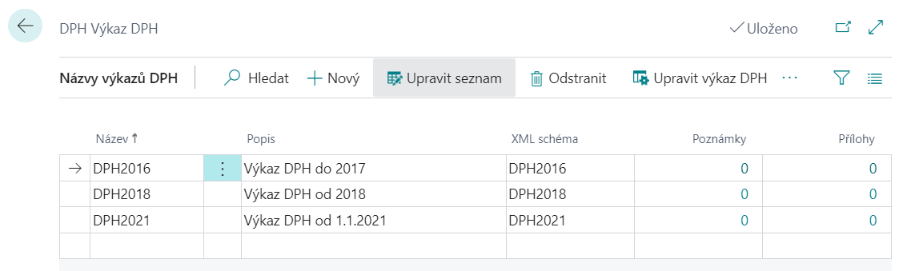
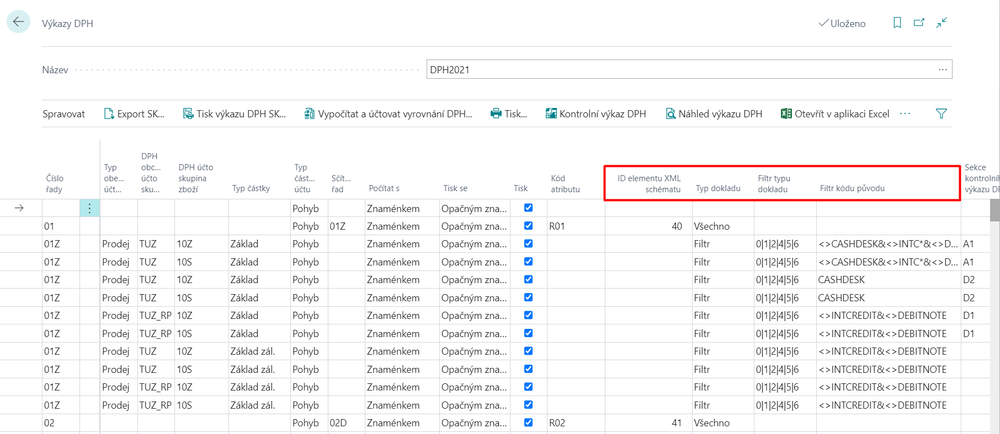
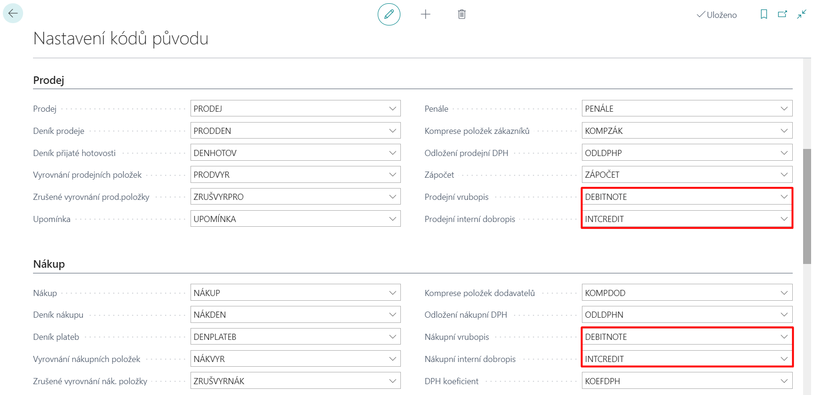

# VAT Statements - Setup

The standard functionality of the system is used to generate the VAT statement. This functionality has been modified by the specifics of Slovak reporting.

To ensure the correct calculation of the amounts of the VAT Statement and export to the required XML structure according to Slovak legislation, it is necessary to set up several areas listed below.

## General Ledger Setup

To activate Slovak functionality, follow these steps:

1. Choose the , icon, enter **General Ledger Setup** and then choose the related link.
2. On the **General Ledger Setup** page you must select**SK** in **Legislation**field.
3. Confirm with the **OK** button.

## Setting up XML schemas

Import the current XML schema template into the XML schemas by following these steps:

1. Choose the , icon, enter **XML Schemas** and then choose the related link.
2. On the **XML Schemas** page, in the **Actions** section, select the **Load Schema**action.
3. An import window will open where you select the appropriate XML file.
4. After import, a new line appears on the **XML Schemas**.
5. In the appropriate row for each XML, select the correct number in the SML portID column.
   For VAT Report from 2018 it is **52068861**, for VAT Report until 2017 it is **52068860**, for VAT Control Report **52068903** nd for Summary Report that is **52068870**.
6. In the **Assigned to legislation** field, select **SK**.
7. Confirm with the **OK** button.

## VAT Statement template settings

Use the following procedure to set up:

1. Choose the , icon, enter **VAT Statement Templates** and then choose the related link.
2. On the **VAT Statement Templates** page, select **Use XML Schema** in the **XML SK Format** column.
3. On the **VAT Report Templates** page, select the **Related**section, then the **Template** section and open the **Report Names**.
4. On the **VAT Statement** page, select the appropriate schema for each line that will be used when you export the **XML Schema** field.
5. Confirm with the **OK** button.

You can see an example in the picture below:

## Set up VAT Statement lines

To ensure proper VAT reporting, you need to set up fields in the VAT statement lines:

1. Choose the , icon, enter **VAT Statements** and then choose the related link.
2. For each line in the sales tax statement, define the following fields:

- Source Code filter
- Document type
- Document type filter
- XML schema element ID - the VAT attribute code will be automatically filled in by the fill-in

3. Confirm with the **OK** button.

You can see an example in the picture below:

## Set up source codes for internal corrective documents

Use the following procedure to set up:

1. Choose the , icon, enter **Source Code Setup** and then choose the related link.
2. On the Sales FastTab, enter INTCREDIT in the **Sales internal credit memo** field and DEBITNOTE in the **Sales debit note** field. The values ​​must first be entered in the Source Codes
3. On the Purchase FastTab, enter INTCREDIT in the **Purchase internal credit memo** field and DEBITNOTE in the **Purchase debit note** field. The values ​​must first be entered in the Source Codes

## Setting up Domestic Self Assessment

The standard Tariff Numbers tab is used to set up commodities that fall under the domestic self-taxation regime.
In General ledger setup and VAT posting setup, you can enable system controls when you post these commodities.

### Set up Tariff Numbers

1. Choose the , icon, enter **Tariff Numbers** and then choose the related link.
2. Define each commodity code and tick the **Domestic Self Assessment** field for these code.
3. For codes in Domestic Self Assessment mode, enter the **Statement Code** field.
4. Confirm with the **OK** button.

### General Ledger Setup - 	Domestic Self Assessment

1. Choose the , icon, enter **General Ledger Setup** and then choose the related link.
2. On the **General Ledger Setup** define **tVAT Base for Domestic Self As.** and **Due Date of from Self Ass.** fields.
3. Confirm with the **OK** button.

### VAT Posting Setup - Domestic Self Assessment

1. Choose the , icon, enter **VAT Posting Setup** and then choose the related link.
2. On the **VAT posting setup** tab, you can set up checks for Domestic Self Assessment on individual combinations of VAT posting groups in the **Reverse Charge Check** field.
3. Confirm with the **OK** button.

## See also

[AUTOCONT Solutions](../index.md)  
[SK Legislative Pack](ac-sk-legislative-pack.md)   
[VAT Statement - Export](ac-sk-vat-statement-export.md)
