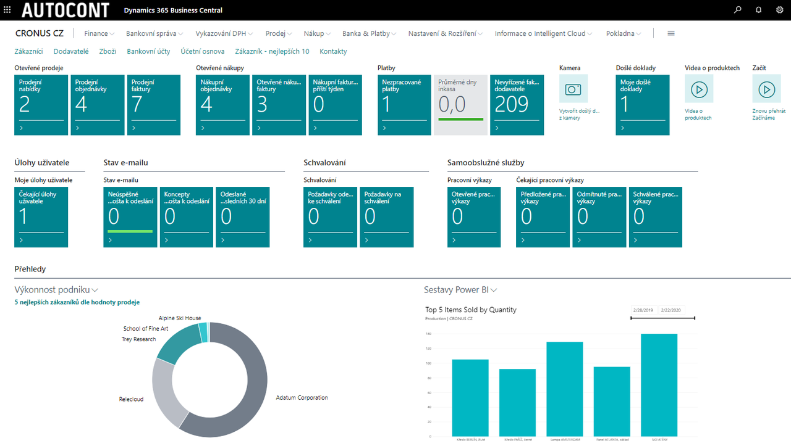

# Microsoft Dynamics 365 Business Central

Microsoft Dynamics 365 Business Central is a modern information system for small and medium-sized companies looking for a simple and easily customizable solution with comprehensive coverage of their needs and an intuitive user experience. It offers increased productivity and competitiveness, saves upfront investment and reduces operational and safety concerns.

Data is available anytime and from anywhere. Operation of the information system is possible in the cloud or in your own environment. Online system operation in the cloud has a major advantage in lower initial implementation costs, ensured security, and easier system updates. Users can connect from a computer, smartphone or tablet with Google Android or Apple iOS.

More information about Business Central can be found on our [website ACDynamics365.cz](https://www.acdynamics365.cz/aplikace/provoz-mensi-firmy).

**Implementing Microsoft Dynamics 365 Business Central from AUTOCONT is easy and fast thanks to a wide range of extension modules and industry solutions.**

## AUTOCONT EXTENSION MODULES

We are expanding the standard Dynamics 365 Business Central system with a range of functionality complementing legislative requirements and best practices.
We have grouped the individual functionalities into the following packages.

### [AC Financial Pack](../AC-FinancialPack/ac-finance-pack.md) - extension for finance
- App Extension Set
- Insolvency register
- Factoring
- More payments
- Fiscal printers
- Pack Tracking Basic (EKOKOM)
- Pack Tracking - Return Packing

### [AC Productivity Pack](../AC-ProductivityPack/ac-productivity-pack.md) - productivity extension
- Electronic invoicing
- Data boxes
- Incoming Mail
- General parameters
- SharePoint publishing
- Job Queue extension
- Transport - basic
- Transport - planning
- WorkFlow - State Management
- Notifications
- Complaints Management
- HelpDesk
- Central Database
- Spooler
- Production Tools
- Parcels
### [SK Legislative Pack](../AC-SK/ac-sk-legislative-pack.md) - extension to Slovak legislation and Slovak language

## AUTOCONT INDUSTRY SOLUTIONS
In addition to the expansion modules, the specialized industry solutions listed below are available.

- Spa, hotel and wellness
- Transport and logistics
- Project and order management
- Assembly production
- Nonprofit organizations
- Service companies
- Holding companies
- Publishing
- Pharmaceutical and cosmetics industry
- Wholesale and retail, distribution
- and a number of other

## See also
[AC Financial Pack](../AC-FinancialPack/ac-finance-pack.md)  
[AC Productivity Pack](../AC-ProductivityPack/ac-productivity-pack.md)  
[SK Legislative Pack](../AC-SK/ac-sk-legislative-pack.md)